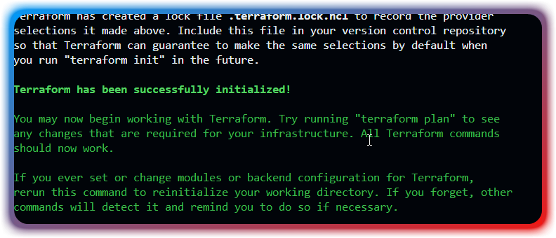
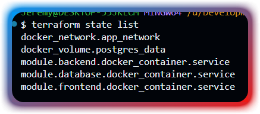
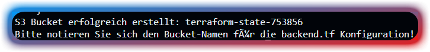
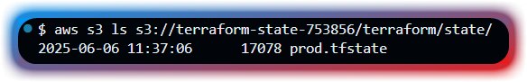

# Terraform Multi-Container Projekt

## Beschreibung
Dieses Projekt demonstriert die Verwendung von Terraform zur Verwaltung einer Multi-Container-Anwendung mit:
- PostgreSQL Datenbank
- Node.js Backend
- Nginx Frontend
- Docker Netzwerk und Volumes

## Voraussetzungen
- Terraform (Version 1.6.0 oder höher)
- Docker Desktop für Windows
- Git

## Projektstruktur
```
terraform-project/
├── modules/
│   └── container-service/
│       ├── main.tf
|       ├── outputs.tf
│       ├── variables.tf
│       └── outputs.tf
├── main.tf
├── variables.tf
├── create-s3-bucket.ps1
├── cleanup-s3-bucket.ps1
├── backend.tf
├── outputs.tf
├── provider.tf
├── locals.tf
└── README.md
```

Die Datei create-s3-bucket.ps1 ist ein Powershell Script das genutzt werden kann um den S3 Bucket zu erstellen, nach einem Erfolgreichen AWS CLI Login.
Alternativ könnte man es auch umschreiben in ein GitBash Script.
Das cleanup-s3-bucket.ps1 Script hingegen löscht den vorhandenen S3 Bucket sowie alle Dateien darin.

Beides kann innerhalb der Powershell dann mit einem einfach Command ausgeführt werden.
```
./create-s3-bucket.ps1
./cleanup-s3-bucket.ps1
```

## Verwendung
1. Repository klonen
2. In das Projektverzeichnis wechseln
3. Terraform initialisieren: `terraform init`
4. Infrastruktur planen: `terraform plan`
5. Infrastruktur erstellen: `terraform apply`
6. Infrastruktur löschen: `terraform destroy`


## Remote State Konfiguration

Diese Implementierung verwendet AWS S3 als Remote State Backend für folgende Vorteile:
- Zentrale State-Verwaltung für Teamarbeit
- Automatische Versionierung durch S3 Bucket Versioning
- Verschlüsselung der State-Dateien
- Hohe Verfügbarkeit und Dauerhaftigkeit durch AWS S3

### AWS S3 Backend Konfiguration
```hcl
terraform {
  backend "s3" {
    bucket = "terraform-state-123456"       # Hier muss der entsprechende Name des Buckets eingetragen werden, dies ist nur ein Platzhalter
    key    = "terraform/state/prod.tfstate"
    region = "eu-central-1"
    encrypt = true
  }
}
```

### State Migration Prozess
Die Migration zum Remote State erfolgte in folgenden Schritten:
1. Erstellung des S3 Buckets mit Versioning und Verschlüsselung
2. Konfiguration des S3 Backends in der `backend.tf`
3. Migration des lokalen States durch `terraform init`
4. Überprüfung der erfolgreichen Migration im AWS S3 Console

### Sicherheitsmaßnahmen
- Server-seitige Verschlüsselung (SSE-S3)
- S3 Bucket Versioning aktiviert
- Sichere HTTPS Übertragung
- IAM-basierte Zugriffssteuerung

___ 

## Deployment Beweise

### Erfolgreicher Apply


### Laufende Container


### Frontend Ansicht


### Terraform Outputs


## Remote State Screenshots

### Erfolgreicher Init


### Terraform State List


### S3 Bucket Create


### S3 Bucket List Items
