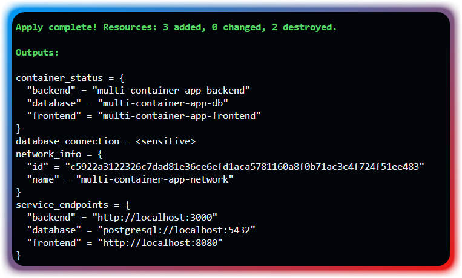
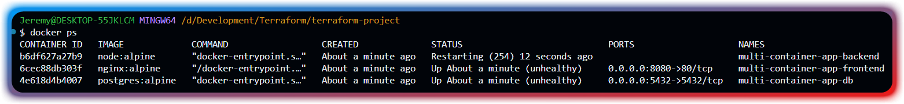
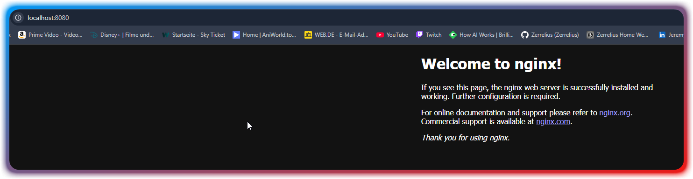
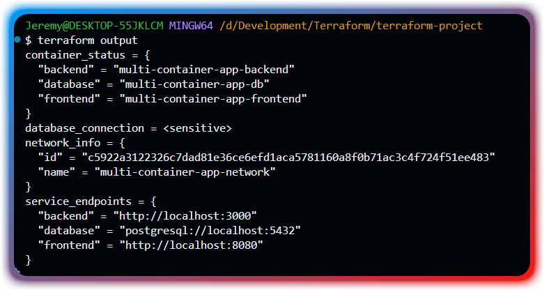

# Terraform Multi-Container Projekt

## Beschreibung
Dieses Projekt demonstriert die Verwendung von Terraform zur Verwaltung einer Multi-Container-Anwendung mit:
- PostgreSQL Datenbank
- Node.js Backend
- Nginx Frontend
- Docker Netzwerk und Volumes

## Voraussetzungen
- Terraform (Version 1.6.0 oder höher)
- Docker Desktop für Windows
- Git

## Projektstruktur
```
terraform-project/
├── modules/
│   └── container-service/
│       ├── main.tf
│       ├── variables.tf
│       └── outputs.tf
├── main.tf
├── variables.tf
├── outputs.tf
├── provider.tf
├── locals.tf
└── README.md
```

## Verwendung
1. Repository klonen
2. In das Projektverzeichnis wechseln
3. Terraform initialisieren: `terraform init`
4. Infrastruktur planen: `terraform plan`
5. Infrastruktur erstellen: `terraform apply`
6. Infrastruktur löschen: `terraform destroy`

## Deployment Beweise

### Erfolgreicher Apply


### Laufende Container


### Frontend Ansicht


### Terraform Outputs
